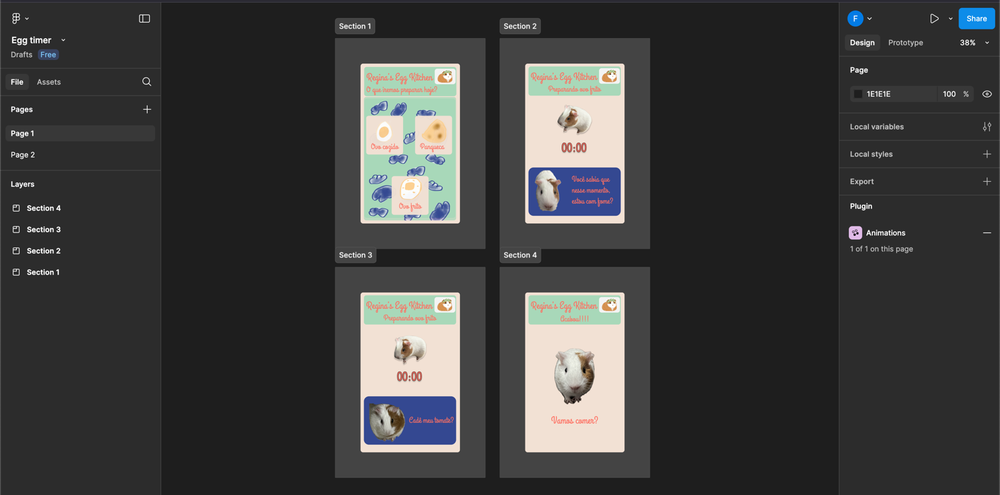

# Regina's Egg Timer

## Descrição
Olá, inspirado em um reels, decidi fazer uma versão de um simples timer para preparar ovos.

https://www.instagram.com/reel/DFeY3gBtsLn

Com isso, acabei me utilizando de Figma, que era algo que eu já tive que seguir em ambiente de trabalho,
mas nunca tive a oportunidade de fazer o meu próprio. Logo foi até divertido criar um rsrs.

Os desenhos fiz no meu Iphone, como você pode ver, sou um péssimo desenhista, mas acho que deu para 
ilustrar o que eu queria rsrs.

Para executar o projeto, simplesmente clone o projeto e execute

``
npm run dev
``

O layout com toda a certeza não vai se encaixar perfeitamente na sua tela, é que fiz pensando no app 
ser executado no Iphone 13, pelo Safari.

Para pausar o tempo, simplesmente clique na Regina giratória heheh.

React não é um dos meus fortes, então qualquer crítica será bem vinda :)

### Figma

### App rodando no iphone
